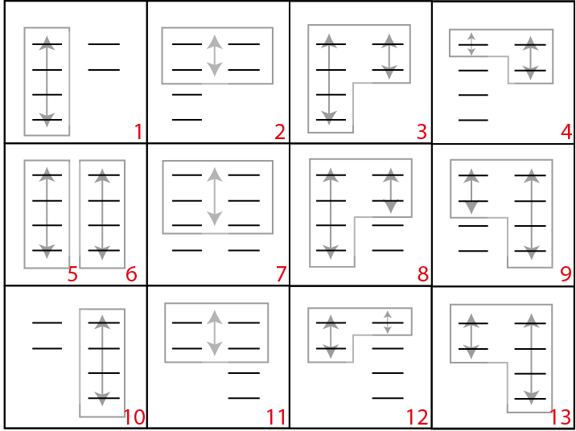

# _Задача 1. Розыгрыш резюме рьяными работниками_

**Условие задачи**

Ограничение времени, с	1

Ограничение памяти, МБ	64

Общее число попыток отправки	15

  У HR Маши на столе лежат две стопки резюме, размерами n и m, в каждом из резюме указана зарплата, числа a[0..n-1] для одной стопки, и b[0..m-1] для второй. Нулевой индекс указывает на верхнее резюме в стопке.

Маша устанавливает значение s максимальной суммы зарплат и предлагает очень активному стажеру Саше сыграть в игру:

- За каждый ход Саша может взять одно верхнее резюме из любой стопки и забрать себе в работу
- Саша считает сумму всех зарплат из резюме, которые он взял. Он может брать новые резюме из стопок только таким образом, чтобы эта сумма не превышала s
- Игра заканчивается, если Саша больше не может брать резюме

Нужно выяснить, какое максимальное количество резюме Саша мог бы забрать себе в работу, если бы тоже знал зарплаты, указанные в каждом резюме.

Входные данные (поступают в стандартный поток ввода)
Первая строка – целые числа n, m и s через пробел (1≤n≤10 000, 1≤m≤10 000, 1≤s≤200 000 000)

Далее идут строки с зарплатами резюме в стопках. Всего строк столько, сколько резюме в большей из стопок, на каждой строке один из вариантов:

- два целых числа a и b через пробел (1≤a≤10 000, 1≤b≤10 000),
- a и символ - (если во второй стопке больше нет резюме) через пробел (1≤a≤10 000)
- символ - (если в первой стопке больше нет резюме) и b через пробел (1≤b≤10 000)
  Все входные данные наших тестов всегда соблюдают указанные параметры, дополнительные проверки не требуются

**Выходные данные** (ожидаются в стандартном потоке вывода)
Одно целое число, максимальное количество резюме

**_Пример 1_**

<table>
<tr><th>Ввод</th><th> Вывод</th></tr> <!--ряд с ячейками заголовков-->
<tr><td> 3 4 11 <br> 1 1 <br> 2 2 <br> 3 3 <br> - 4 </td><td>5 </td></tr> <!--ряд с ячейками тела таблицы-->
</table>


Оптимальным алгоритмом здесь будет просто брать верхние резюме из каждой стопки 1 + 1 + 2 + 2 + 3 = 9. Дальше резюме брать нельзя, потому что сумма станет выше 11, поэтому возвращаем 5.

**_Пример 2_**

<table>
<tr><th>Ввод</th><th> Вывод</th></tr> <!--ряд с ячейками заголовков-->
<tr><td> 5 5 10 <br> 5 1<br> 1 3 <br> 1 3 <br> 1 3 <br> 1 3 </td><td> 6 </td></tr> <!--ряд с ячейками тела таблицы-->
</table>

Здесь ситуация интереснее, и играет роль то, что Саша знает все зарплаты во всех резюме, оптимально для него будет взять сначала всю левую стопку по порядку 5 + 1 + 1 + 1 + 1 = 9, а потом взять еще верхнее резюме из правой 9 + 1 = 10. Итого 6 резюме.


Пример 3

<table>
<tr><th>Ввод</th><th> Вывод</th></tr> <!--ряд с ячейками заголовков-->
<tr><td> 6 4 10 <br>4 2 <br> 2 1 <br> 4 8 <br> 6 5 <br> 1 - <br> 7 - </td><td> 4 </td></tr> <!--ряд с ячейками тела таблицы-->
</table>

Этот пример похож на первый, просто показывает, как выглядит ввод для ситуации, когда вторая стопка меньше первой

**Примечания по оформлению решения**

Возможно использование только стандартных библиотек языков, установки и использование дополнительных библиотек невозможны.

При отправке решений на Java необходимо назвать исполняемый класс Main. В решении не нужно указывать пакет.

Примеры работы со стандартными потоками ввода и вывода

в Java можно использовать java.util.Scanner и System.out.println:
```java
Scanner in = new Scanner(System.in);
String line = in.nextLine();
...
System.out.println(result);
```
Перед отправкой решения рекомендуем запустить тесты из раздела Тестирование, они помогут поймать синтаксические ошибки и ошибки выполнения.


### Мой алгоритм решения

Я совершала перебор всех возможных значений и выбирала наибольшее.
1) ищем сумму зарплат верхних резюме из обоих стопок sum
2) для каждого столбца заводим суммы sumA=sum и sumB=sum. И добавляем идя по соответсвующим столбам добавляем к ним элементы из соответствующих столбцов, пока они не станут больше S. Смотрим сколько элементов получилось добавить в обоих случаях. Выбираем большее и присваеваем переменной V.
3) делаем шаг 1

### Тесты

Скинуты два запускаемых файла: В одном происходит чтение из консоли, как этого требует условие задачи, а во втором прописаны тесты. Нумерация тестов соответсвует такому построению тестов:
 <p align="center"></p>
